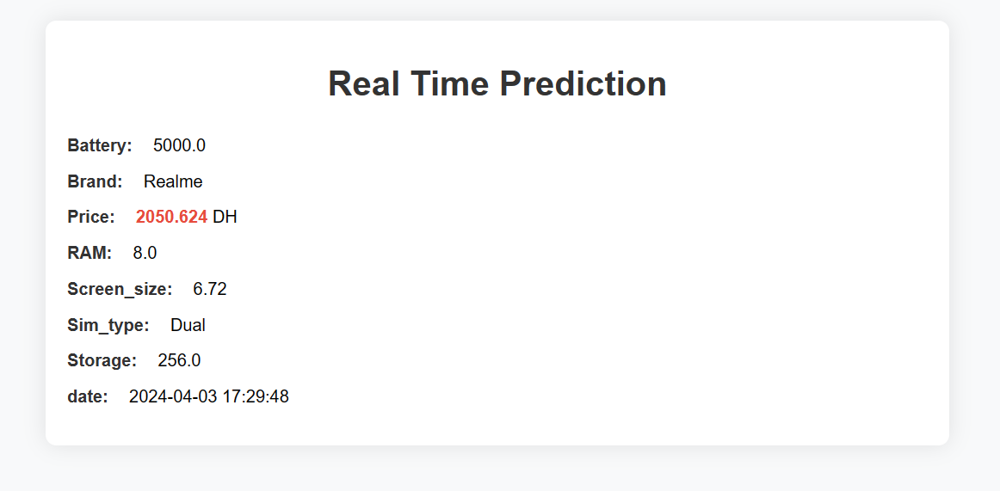

## 6. How to Run
To set up and run the project locally, follow these steps:

  - Clone the repository:
   ```bash
   git clone https://github.com/aymane-maghouti/Big-Data-Project
   ```


#### **1. Stream Layer**
   - Start Apache zookeeper

   ```batch 
zookeeper-server-start.bat C:/kafka_2.13_2.6.0/config/zookeeper.properties
```
   - Start Kafka server

   ```batch 
kafka-server-start.bat C:/kafka_2.13_2.6.0/config/server.properties
```
   - Create Kafka topic

   ```batch 
kafka-topics.bat --create --topic smartphoneTopic --bootstrap-server localhost:9092
```

  - Run the kafka producer

   ```batch 
kafka-console-producer.bat --topic smartphoneTopic --bootstrap-server localhost:9092
```

  - Run the kafka consumer

   ```batch 
kafka-console-consumer.bat --topic smartphoneTopic --from-beginning --bootstrap-server localhost:9092
```

  - Start HDFS and yarn (start-all or start-dfs and start-yarn)

   ```batch 
start-all  
```
   - Start Hbase
   ```batch 
start-hbase  
```
   - Run thrift server (for Hbase)
   ```batch 
hbase thrift start
```

after all this run `stream_pipeline.py` script.

and then open the spring boot appliation in your idea and run  it (you can access to the web app locally on  `localhost:8081/`)

---


note that there is another version of the web app developed using Flask micro-framework(watch the demo video for mor details)

#### **2. Batch Layer**
   - Start the Apache Airflow instance: 

   ```batch 
docker-compose up -d
```
   Access the Apache Airflow web UI (localhost:8080) and run the DAG
   - Start Apache Spark

   ```batch 
spark-shell
```

   - Start Apache zookeeper

   ```batch 
zookeeper-server-start.bat C:/kafka_2.13_2.6.0/config/zookeeper.properties
```
   - Start Kafka server

   ```batch 
kafka-server-start.bat C:/kafka_2.13_2.6.0/config/server.properties
```

  - Run the kafka producer

   ```batch 
kafka-console-producer.bat --topic smartphoneTopic --bootstrap-server localhost:9092
```

  - Run the kafka consumer

   ```batch 
kafka-console-consumer.bat --topic smartphoneTopic --from-beginning --bootstrap-server localhost:9092
```

  - Run HDFS and yarn (start-all or start-dfs and start-yarn)

   ```batch 
start-all  
```
   - Open power BI file `dashboard.pbix` attached with this project 

after all this run `syc_with_Airflow.py` script.


## 7. Dashboards

This project utilizes two dashboards to visualize smartphone price predictions and historical data:

#### **1. Real-Time Dashboard (Spring Boot Application):**

- This dashboard is built using a Spring Boot web application.
- It displays the **predicted price of smartphones in real-time**.
- Users can access this dashboard through a web interface. 


Here is the UI of th Spring Boot web application:





#### **2. Batch Dashboard (Power BI):**

- This dashboard leverages Power BI for interactive data exploration.
- It provides insights into **historical smartphone price trends**.
- This dashboard is designed for batch users interested in historical analysis.


Here is the  Dashboard created in Power BI:


## 8. Acknowledgments

- Special thanks to the open-source communities behind `Python`, `Kafka`, `HDFS` , `Spark`,`Hbase`,`Spring Boot`and `Airflow`

## 9. Conclusion

- This big data architecture effectively predicts smartphone prices in real-time and provides historical analysis capabilities. The Lambda architecture facilitates efficient stream processing for real-time predictions using XGBoost and HBase, while Apache Airflow orchestrates batch processing with Spark to populate the PostgreSQL data warehouse for historical insights. This solution empowers real-time and batch users with valuable price information, enabling data-driven decision-making.

you can watch the demo video <a href="https://youtu.be/iClZyC_TZyA" target="_blank">here</a> 

## 10. Contacts

For any inquiries or further information, please contact:
- **Name:** Aymane Maghouti
- **Email:** aymanemaghouti16@gmail.com
- **LinkedIn:** <a href="https://www.linkedin.com/in/aymane-maghouti/" target="_blank">Aymane Maghouti</a><br>
