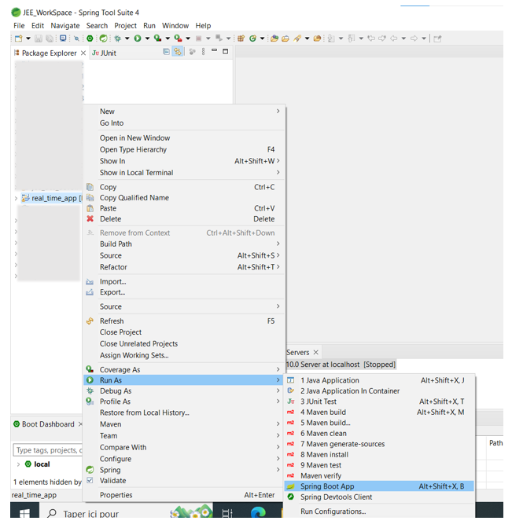

## 6. How to Run
To set up and run the project locally, follow these steps:

  - Clone the repository:
   ```bash
   git clone https://github.com/aymane-maghouti/Big-Data-Project
   ```


#### **1. Stream Layer**
   - Start Apache zookeeper

   ```batch 
zookeeper-server-start.bat C:/kafka_2.13_2.6.0/config/zookeeper.properties
```
   - Start Kafka server

   ```batch 
kafka-server-start.bat C:/kafka_2.13_2.6.0/config/server.properties
```
   - Create Kafka topic

   ```batch 
kafka-topics.bat --create --topic smartphoneTopic --bootstrap-server localhost:9092
```

  - Run the kafka producer

   ```batch 
kafka-console-producer.bat --topic smartphoneTopic --bootstrap-server localhost:9092
```

  - Run the kafka consumer

   ```batch 
kafka-console-consumer.bat --topic smartphoneTopic --from-beginning --bootstrap-server localhost:9092
```

  - Start HDFS and yarn (start-all or start-dfs and start-yarn)

   ```batch 
start-all  
```
   - Start Hbase
   ```batch 
start-hbase  
```
   - Run thrift server (for Hbase)
   ```batch 
hbase thrift start
```

after all this run `stream_pipeline.py` script.

and then open the spring boot appliation in your idea and run  it (you can access to the web app locally on  `localhost:8081/`)

---




note that there is another version of the web app developed using Flask micro-framework(watch the demo video for mor details)


---

Thay bằng: 
1. thay bằng `docker-compose -f docker-compose-stream.yml up -d`

```bash

PS D:\OneDrive - Hanoi University of Science and Technology\GIT\BigData-Project\Big-Data-Project_2\Main\Lambda> docker network ls
NETWORK ID     NAME                    DRIVER    SCOPE
bc2bf2a7361c   batch_layer_default     bridge    local
85613aaea658   bridge                  bridge    local
30149d731c72   host                    host      local
e26a4cf556ce   lambda_stream-network   bridge    local
dd052fff3f84   none                    null      local
28fd717c4091   src_default             bridge    local
```

### 2. Chỉnh các file trong `Stream_layer` để kết nối đúng với hbase và kafka. Đến 1 lúc kết quả sẽ đúng. 


Từ log, tôi thấy hệ thống đang hoạt động như sau:

1. **Producer hoạt động tốt:**
```
17:14:52 Produced: ['349', 'Realme', 'C21Y ',...] to Kafka topic: smartphoneTopic
17:14:52 Message sent to Kafka topic
```

2. **ML Pipeline hoạt động:**
```
17:15:02 before ml operation
17:15:02 ['43', 'Samsung', 'Galaxy A03 Core ',...]
17:15:02 [8, 6.5, 2.0, 32.0, 1, 5000.0]
17:15:02 ['Samsung', 6.5, 2.0, 32.0, 'Dual', 5000.0]
17:15:02 ['Samsung', 6.5, 2.0, 32.0, 'Dual', 5000.0, 981.75995]
```
- Nhận dữ liệu
- Xử lý features
- Dự đoán giá: 981.75995

3. **Warning từ XGBoost:**
```
17:15:02 WARNING: /workspace/src/common/error_msg.h:80: If you are loading a serialized model...
```
- Cảnh báo về việc sử dụng serialized model
- Không ảnh hưởng đến kết quả dự đoán

4. **Vấn đề:**
- Không thấy log về việc lưu dữ liệu vào HBase
- Không thấy error log về kết nối HBase như trước

Cần kiểm tra:

- Đảm bảo các services khởi động theo đúng thứ tự (Zookeeper → HBase → Kafka → Stream Pipeline → Web App)


#### **2. Batch Layer**

```
1. Start the Apache Airflow instance:
docker-compose up -d
Access the Apache Airflow web UI (localhost:8080) and run the DAG

@docker-compose.yaml 


2. Start Apache Spark
spark-shell

3. Start Apache zookeeper
zookeeper-server-start.bat C:/kafka_2.13_2.6.0/config/zookeeper.properties

4. Start Kafka server
kafka-server-start.bat C:/kafka_2.13_2.6.0/config/server.properties
Run the kafka producer
kafka-console-producer.bat --topic smartphoneTopic --bootstrap-server localhost:9092
Run the kafka consumer
kafka-console-consumer.bat --topic smartphoneTopic --from-beginning --bootstrap-server localhost:9092

5. Run HDFS and yarn (start-all or start-dfs and start-yarn)
start-all  

======

Viết thành @docker-compose-batch.yml 
```


```
1. Check: Airflow và Dags: 
- Lỗi đường dẫn nên mình đã sửa bằng cách đưa hàm batch_layer vào dags luôn. 
- Check = PORT: 8080
2. Check: 
Apach Spark Master và Apach Spark Worker là gì ?? 
- Master: 7077 (bug), và 9090:8080  (ok)
- Worker: ??? ko có port

"""
Apache Spark Master và Worker là hai thành phần chính trong kiến trúc phân tán của Apache Spark:

1. **Spark Master (Node chủ)**:
- Là trung tâm điều phối của cụm Spark
- Nhiệm vụ chính:
  - Phân phối công việc cho các Worker nodes
  - Quản lý tài nguyên trong cụm
  - Theo dõi trạng thái của các Worker
  - Điều phối việc thực thi các task
- Giống như "người quản lý" điều phối công việc

2. **Spark Worker (Node công nhân)**:
- Là các node thực thi công việc
- Nhiệm vụ chính:
  - Thực thi các task được Master giao
  - Báo cáo trạng thái cho Master
  - Quản lý tài nguyên cục bộ (CPU, RAM)
- Giống như "công nhân" thực hiện công việc

Ví dụ hoạt động:
```
1. Client gửi job đến Master
2. Master phân tích job và chia thành các task
3. Master phân phối tasks cho các Worker
4. Workers thực thi tasks và gửi kết quả về
5. Master tổng hợp kết quả và trả về Client
```

Trong docker-compose của bạn:
```yaml
spark-master:
    environment:
      - SPARK_MODE=master
      - SPARK_WORKER_MEMORY=1G
      - SPARK_WORKER_CORES=1

spark-worker:
    environment:
      - SPARK_MODE=worker
      - SPARK_MASTER_URL=spark://spark-master:7077
      - SPARK_WORKER_MEMORY=1G
```

- Master được cấu hình với 1GB RAM và 1 core
- Worker kết nối đến Master qua port 7077
- Worker cũng được cấp 1GB RAM để xử lý task

"""

"""
Ah, tôi hiểu vấn đề của bạn:

1. **Port 7077**:
- Port này là RPC port (Remote Procedure Call) dùng cho giao tiếp nội bộ giữa Master và Worker
- Không phải là Web UI port nên không thể truy cập bằng browser
- Chỉ dùng cho Spark internal communication

2. **Worker Port**:
- Thiếu port mapping cho Worker UI
- Sửa lại docker-compose như sau:

```yaml:Main/Lambda/Batch_layer/docker-compose-batch.yml
spark-worker:
    image: bitnami/spark:latest
    container_name: spark-worker
    environment:
      - SPARK_MODE=worker
      - SPARK_MASTER_URL=spark://spark-master:7077
      - SPARK_WORKER_MEMORY=1G
      - SPARK_WORKER_CORES=1
      - SPARK_RPC_MESSAGE_MAX_SIZE=2047
      - SPARK_NETWORK_MAX_MESSAGE_SIZE=2047
      # Thêm port cho Worker UI
      - SPARK_WORKER_WEBUI_PORT=8081
    ports:
      - "8081:8081"  # Export Worker UI port
    depends_on:
      - spark-master
    networks:
      - batch_network
```

Sau khi sửa:
1. Spark Master UI: `http://localhost:9090`
2. Spark Worker UI: `http://localhost:8081`
3. Port 7077: Chỉ dùng cho internal communication

Kiểm tra:
```bash
# Restart services
docker-compose -f docker-compose-batch.yml down
docker-compose -f docker-compose-batch.yml up -d

# Check logs
docker logs spark-master
docker logs spark-worker
```

Bây giờ bạn có thể:
- Xem Master UI ở port 9090
- Xem Worker UI ở port 8081
- Port 7077 vẫn hoạt động cho internal communication

"""


Check UI tại: 
- Master: `http://localhost:9090`
- Worker: `http://localhost:8081`

### 3. Apach Kafka: 

Các thay đổi chính:
Tăng MESSAGE_MAX_BYTES và các giới hạn liên quan lên 2GB
Tăng buffer size cho socket
Tăng fetch size cho partition

Nếu vẫn gặp lỗi, có thể:
- Giảm kích thước message gửi đi
- Hoặc tăng thêm các giới hạn:


Memory Manager trong Kafka batch có các thành phần chính:

1. **Heap Memory Management**:
```yaml
KAFKA_HEAP_OPTS: "-Xmx4G -Xms4G"
```
- `-Xmx4G`: Maximum heap size (tối đa 4GB)
- `-Xms4G`: Initial heap size (khởi tạo 4GB)
- Dùng cho: Java runtime, broker operations, cache

2. **Network Memory**:
```yaml
KAFKA_SOCKET_RECEIVE_BUFFER_BYTES: 1024000
KAFKA_SOCKET_SEND_BUFFER_BYTES: 1024000
```
- Buffer cho network operations
- Xử lý incoming/outgoing requests

3. **Message Size Management**:
```yaml
KAFKA_MESSAGE_MAX_BYTES: 2000000000        # Max message size
KAFKA_MAX_REQUEST_SIZE: 2000000000         # Max request size
KAFKA_MAX_PARTITION_FETCH_BYTES: 2000000000 # Max data per partition fetch
```

4. **Thread Management**:
```yaml
KAFKA_NUM_NETWORK_THREADS: 3    # Network threads
KAFKA_NUM_IO_THREADS: 8         # I/O threads
KAFKA_BACKGROUND_THREADS: 10    # Background processing
```

5. **Queue Management**:
```yaml
KAFKA_QUEUED_MAX_REQUESTS: 500  # Max requests in queue
```

Cách hoạt động:
1. Network threads nhận requests
2. Requests được đưa vào queue
3. I/O threads xử lý từ queue
4. Background threads xử lý maintenance tasks

Khi gặp vấn đề memory:
1. Tăng heap size
2. Giảm message size
3. Điều chỉnh số lượng threads
4. Monitor memory usage


### 4. Apach Zookeeper: 
- Vẫn còn lỗi "Len error 1195725856" với Zookeeper. 
- Có thể do các config không đúng. 
- Cần kiểm tra lại các config trong docker-compose-batch.yml và các file cấu hình khác. 


Vẫn còn lỗi "Len error 1195725856" với Zookeeper. Hãy thử điều chỉnh lại cấu hình Zookeeper như sau:

```yaml:Main/Lambda/Batch_layer/docker-compose-batch.yml
zookeeper:
    image: confluentinc/cp-zookeeper:7.4.0
    container_name: zookeeper-batch
    ports:
      - "2182:2181"
    environment:
      ZOOKEEPER_CLIENT_PORT: 2181
      ZOOKEEPER_TICK_TIME: 2000
      ZOOKEEPER_SYNC_LIMIT: 2
      ZOOKEEPER_INIT_LIMIT: 5
      
      # Tăng buffer size và memory
      JVMFLAGS: >-
        -Djava.awt.headless=true
        -Xmx2G -Xms2G
        -Dzookeeper.maxClientCnxns=60
        -Dzookeeper.jute.maxbuffer=8388608
        -XX:+UseG1GC
        -XX:MaxGCPauseMillis=200
      
      # Giới hạn kết nối và timeout
      ZOOKEEPER_MAX_CLIENT_CNXNS: 60
      ZOOKEEPER_MAX_SESSION_TIMEOUT: 60000
      ZOOKEEPER_MIN_SESSION_TIMEOUT: 6000
      
      # Snapshot và cleanup
      ZOOKEEPER_SNAP_RETAIN_COUNT: 5
      ZOOKEEPER_PURGE_INTERVAL: 12
      ZOOKEEPER_AUTOPURGE_PURGEINTERVAL: 12
      ZOOKEEPER_AUTOPURGE_SNAPRETAINCOUNT: 5

    volumes:
      - zookeeper_data:/var/lib/zookeeper/data
      - zookeeper_log:/var/lib/zookeeper/log
    ulimits:
      nofile:
        soft: 65536
        hard: 65536
    networks:
      - batch_network
```

Các thay đổi chính:

1. Tăng memory và buffer:
   - Heap size: 2GB
   - jute.maxbuffer: 8MB
   - Thêm G1GC collector

2. Điều chỉnh timeout và connections:
   - maxClientCnxns: 60 
   - session timeout: 6s-60s

3. Thêm cấu hình cleanup:
   - Tự động purge mỗi 12 giờ
   - Giữ 5 snapshots

4. Thêm ulimits để tăng số file descriptors

5. Thêm các tham số JVM tối ưu

Sau khi sửa:

```bash
# Xóa volumes cũ
docker-compose -f docker-compose-batch.yml down -v

# Restart với cấu hình mới
docker-compose -f docker-compose-batch.yml up -d

# Kiểm tra logs
docker logs zookeeper-batch
```

Nếu vẫn gặp lỗi:
1. Tăng jute.maxbuffer lên 16MB hoặc 32MB
2. Tăng heap size lên 4GB
3. Giảm số lượng kết nối đồng thời
4. Kiểm tra message size từ Kafka


