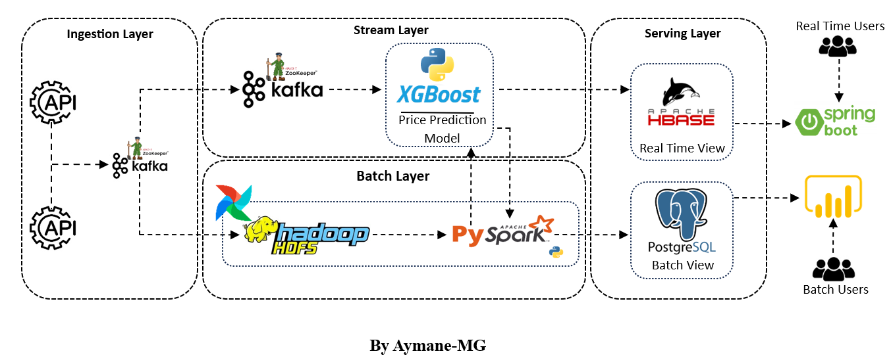
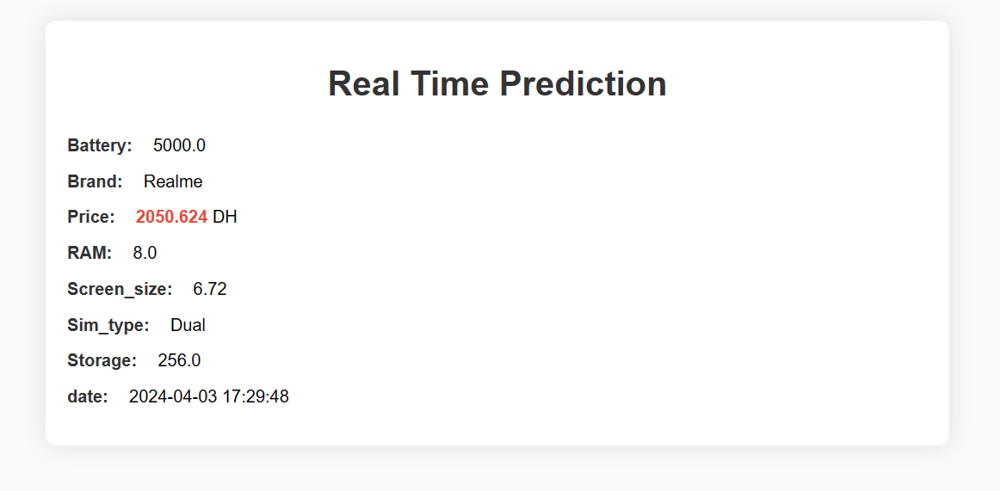

# Smartphone Price Prediction in Big Data Environment

## Table of Contents
1. [Project Overview](#project-overview)
2. [Technologies Used](#technologies-used)
3. [Architecture](#architecture)
4. [Repository Structure](#repository-structure)
5. [Software Requirements for Running the Project](#software-requirements-for-running-the-project)
6. [How to Run](#how-to-run)
7. [Dashboards](#dashboards)
8. [Acknowledgments](#acknowledgments)
9. [Conclusion](#conclusion)
10. [Contacts](#contacts)

## 1. Project Overview
This project aims to predict smartphone prices using a combination of batch and stream processing techniques in a Big Data environment. The architecture follows the Lambda Architecture pattern, providing both real-time and batch processing capabilities to users.

## 2. Technologies Used
* **Ingestion Layer:** Apache Kafka (message broker)
* **Stream Layer:** XGBoost (machine learning model), Apache HBase (real-time database)
* **Batch Layer:** Apache Spark (data processing framework), Apache Airflow (workflow orchestration), PostgreSQL (data warehouse)
* **Visualization:** Spring Boot (web application framework), Power BI (interactive dashboards)


## 3. Architecture

- Here is the architecture :
- 


The project architecture consists of five main layers: the ingestion layer, the batch layer, the stream layer, the serving layer and the visualization layer.

### Ingestion Layer
- **Apache Kafka**: Utilized for real-time data ingestion from an API providing smartphone data.
   - **Consumer**: Collects data from the API and feeds it into the stream and batch layer.

### Stream Layer
- **Producer**: A machine learning model developed using XGBoost to estimate smartphone prices. This model runs in real-time and stores predictions in a realtime view. (details about the model <a href="https://github.com/aymane-maghouti/Sentiment-Analysis-for-Jumia-Reviews-and-Smartphone-Price-Prediction-System" target="_blank">here</a> )

### Batch Layer
- **HDFS**: Data from the API is stored in HDFS as part of the data lake solution.
 - **PySpark**: Performs data transformation on stored data using PySpark.
 - **Apache Airflow**: Orchestrates the batch processing workflow.
### Serving Layer
- **Realtime View**: Implemented using HBase to provide real-time access to predicted smartphone prices.
- **Batch View**: Transformed data is stored in PostgreSQL, as the data warehouse solution.
### Visualization Layer
- **Spring Boot Web Application**: Provides a user interface to view real-time smartphone prices.
- **Power BI Dashboard**: Provides batch users with a visualization of processed data.


## 4. Repository Structure
The repository is organized as follows:
```batch 
tree here
```

## 5. Software Requirements for Running the Project

This project requires the following software to be installed and configured on your system:

**Big Data Stack:**

* **Apache Kafka (version 2.6.0)**
* **Apache HBase (version 1.2.6)** 
* **Apache Hadoop (version 2.7.0)** 
* **Apache Spark (version 3.3.4)** 
* **PostgreSQL database**

**Programming Languages and Frameworks:**

* **Python (version 3.10.x or later)** 
* **Java 17 (or compatible version)** 
* **Spring Boot** 

**Machine Learning Library:**

* **XGBoost** 

**Additional Tools (Optional):**

* **Apache Airflow** 
* **Power BI Desktop** 


By installing and configuring these tools, you will have the necessary environment to run this project and leverage its real-time and batch processing capabilities for smartphone price prediction and analysis.

## 6. How to Run
To set up and run the project locally, follow these steps:

  - Clone the repository:
   ```bash
   git clone https://github.com/aymane-maghouti/Big-Data-Project
   ```


#### **1. Stream Layer**
   - Start Apache zookeeper

   ```batch 
zookeeper-server-start.bat C:/kafka_2.13_2.6.0/config/zookeeper.properties
```
   - Start Kafka server

   ```batch 
kafka-server-start.bat C:/kafka_2.13_2.6.0/config/server.properties
```
   - Create Kafka topic

   ```batch 
kafka-topics.bat --create --topic smartphoneTopic --bootstrap-server localhost:9092
```

  - Run the kafka producer

   ```batch 
kafka-console-producer.bat --topic smartphoneTopic --bootstrap-server localhost:9092
```

  - Run the kafka consumer

   ```batch 
kafka-console-consumer.bat --topic smartphoneTopic --from-beginning --bootstrap-server localhost:9092
```

  - Run HDFS and yarn (start-all means start-dfs and start-yarn)

   ```batch 
start-all  
```
   - Run Hbase
   ```batch 
hbase shell  
```
   - Run thrift server (for Hbase)
   ```batch 
hbase thrift start
```

after all this run `stream_pipeline.py` script.

and then open the spring boot appliation in your idea and run  it (you can access to the web app locally on  `localhost:8081/`)


note that there is another version of the web app developed using Flask micro-framework(watch the demo video for mor details)

#### **2. Batch Layer**
   - Start the Apache Airflow instance: 

   ```batch 
docker-compose up -d
```
   Access the Apache Airflow web UI (localhost:8080) and run the DAG
   - Start Apache Spark

   ```batch 
spark-shell
```

   - Start Apache zookeeper

   ```batch 
zookeeper-server-start.bat C:/kafka_2.13_2.6.0/config/zookeeper.properties
```
   - Start Kafka server

   ```batch 
kafka-server-start.bat C:/kafka_2.13_2.6.0/config/server.properties
```

  - Run the kafka producer

   ```batch 
kafka-console-producer.bat --topic smartphoneTopic --bootstrap-server localhost:9092
```

  - Run the kafka consumer

   ```batch 
kafka-console-consumer.bat --topic smartphoneTopic --from-beginning --bootstrap-server localhost:9092
```

  - Run HDFS and yarn (start-all means start-dfs and start-yarn)

   ```batch 
start-all  
```
   - Open power BI file `dashboard.pbix` attached with this project 

after all this run `batch_pipeline.py` script.


## 7. Dashboards

This project utilizes two dashboards to visualize smartphone price predictions and historical data:

#### **1. Real-Time Dashboard (Spring Boot Application):**

- This dashboard is built using a Spring Boot web application.
- It displays the **predicted price of smartphones in real-time**.
- Users can access this dashboard through a web interface. 


Here is the UI of th Spring Boot web application:




#### **2. Batch Dashboard (Power BI):**

- This dashboard leverages Power BI for interactive data exploration.
- It provides insights into **historical smartphone price trends**.
- This dashboard is designed for batch users interested in historical analysis.


Here is the  Dashboard created in Power BI:


## 8. Acknowledgments

- Special thanks to the open-source communities behind `Python`, `Kafka`, `HDFS` , `Spark`,`Hbase`,`Spring Boot`and `Airflow`

## 9. Conclusion

- This big data architecture effectively predicts smartphone prices in real-time and provides historical analysis capabilities. The Lambda architecture facilitates efficient stream processing for real-time predictions using XGBoost and HBase, while Apache Airflow orchestrates batch processing with Spark to populate the PostgreSQL data warehouse for in-depth historical insights. This solution empowers real-time and batch users with valuable price information, enabling data-driven decision-making.

you can watch the demo video <a href="https://www.youtube.com/watch?v=rVQFABynodw" target="_blank">here</a> 

## 10. Contacts

For any inquiries or further information, please contact:
- **Name:** Aymane Maghouti
- **Email:** aymanemaghouti@gmail.com
- **LinkedIn:** <a href="https://www.linkedin.com/in/aymane-maghouti/" target="_blank">Aymane Maghouti</a><br>
